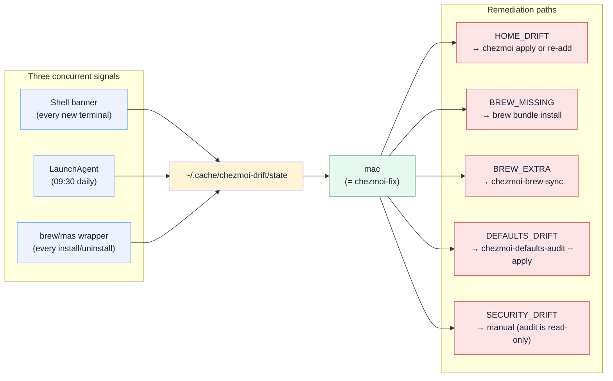

# Runbook: recover from drift

`chezmoi verify` exits non-zero, the shell banner shows "N things need attention", or the daily macOS notification fires. This is "drift" — `$HOME` no longer matches the source state.

## TL;DR — run `mac`

For most drift, the answer is one command:

```bash
mac
```

`mac` is an alias for `chezmoi-fix`. It refreshes the drift cache, summarises pending work across all signals (home-file drift, brew-bundle drift, brew-inbox journal, macOS defaults, security baseline), and dispatches to the right tool. Read the rest of this runbook only when `mac` reports an error, or you want to understand a specific signal in depth.

## Common manual cleanups

`mac` covers the automated paths. A few drift sources need to be cleaned up by hand:

### Stale `~/Brewfile`

A one-off `brew bundle dump` leaves a `~/Brewfile` that chezmoi flags as drift. The canonical source is `Brewfile.tmpl`, rendered to a temp file during apply; a persistent `~/Brewfile` is cruft. Safe to remove:

```bash
rm ~/Brewfile
```

### Stale unmanaged files in `$HOME`

Older render patterns sometimes leave files in `$HOME` that chezmoi no longer tracks (e.g. an orphaned `~/02-brew-bundle.sh`). `chezmoi status` shows them with an `R` prefix (would-be-removed). `chezmoi apply` cleans them up.

### Security audit findings

`chezmoi-security-audit` is read-only — it surfaces findings and the recommended fix, but never applies them. Common findings and how to address them:

- **SSH key passphrase missing** — Add interactively: `ssh-keygen -p -f ~/.ssh/<key>`. The repo does not (and will not) automate this. Optionally `ssh-add --apple-use-keychain ~/.ssh/<key>` to load it into the macOS keychain so daily git/ssh isn't friction.
- **FileVault / SIP / firewall / guest account** — usually configured by `run_once_after_05-macos-sudo.sh` at bootstrap. If a finding appears later, re-run that script (it's idempotent) or address via System Settings.
- **Sensitive file perms** — fix with `chmod 600 <path>`.
- **Energy settings (pmset)** — expected values live in `dot_config/chezmoi/scripts/executable_macos-sudo.sh`; re-run `~/.config/chezmoi/scripts/macos-sudo.sh` to re-assert. Note the idle sleep timer is only half the story: any app holding a power assertion overrides it (`pmset -g assertions` names the holders). Known quiet offenders when the Mac is unexpectedly hot or won't sleep: browser tabs with live WebRTC connections (WhatsApp Web, Meet, etc. — "WebRTC has active PeerConnections"), Amphetamine sessions, and `caffeinate`. The OrbStack VM doesn't hold assertions but runs whenever the Mac is awake, so it burns CPU for as long as anything else keeps the machine up.
- **Pending macOS updates** — `softwareupdate -ia` (interactive; may reboot).

Remediations `mac` performs itself refresh the cache on exit, so the next shell's banner already reflects them. After fixing a finding by hand — as with everything above — run `chezmoi-drift-check --full` (or just `mac` again) so the banner catches up.

## How drift surfaces (signal sources)

Three concurrent signals all feed a single cache, consumed by one entry point:



Three machine-resident signals run automatically; you don't need to remember to check:

- **Shell banner.** A new zsh prints a one-line yellow banner (e.g. `chezmoi: 3 thing(s) need attention — run 'mac'`) when `~/.cache/chezmoi-drift/state` shows non-zero counts. `export CHEZMOI_DRIFT_QUIET=1` silences the banner only — the cache still refreshes in the background and the daily launchd notification still fires.
- **Daily macOS notification.** The launchd agent `com.user.chezmoi-drift` (loaded from `~/Library/LaunchAgents/com.user.chezmoi-drift.plist`) runs at 09:30 and posts a Notification Center alert if drift is found. Logs at `~/Library/Logs/chezmoi-drift.log`. To swap the fire-and-forget notification for a clickable AppleScript dialog with a "Fix now" button that launches iTerm + `chezmoi-fix`, change `--notify` to `--alert` in the plist's `ProgramArguments` and reload (`launchctl unload` + `launchctl load`).
- **`brew` / `mas` wrapper.** After `brew install/uninstall/reinstall/tap/untap` (or `mas install/uninstall/purchase`), the wrapper appends an event to `~/.cache/chezmoi-brew-inbox/journal.ndjson` and refreshes the drift cache asynchronously. The shell banner on the next session shows the pending count; `mac` walks the merge interactively.

The single source of truth is `~/.local/bin/chezmoi-drift-check` — `make drift` is a shortcut for `chezmoi-drift-check --full`.

The cache state file (`~/.cache/chezmoi-drift/state`) breaks down as:

| Field | Meaning | Typical fix |
|---|---|---|
| `HOME_DRIFT` | N files chezmoi manages differ from source. | `mac` → "Back up locally-edited files" walks each file with a per-file apply/re-add/skip prompt. Manually: `chezmoi diff` → either `chezmoi apply` (source wins) or `chezmoi re-add` (target wins). |
| `BREW_MISSING` | N entries in `Brewfile.tmpl` not installed locally (typically because something was uninstalled outside the Brewfile flow). | `brew bundle install --file=<(chezmoi execute-template < $(chezmoi source-path)/Brewfile.tmpl)`. |
| `BREW_EXTRA` | N packages installed locally but not in `Brewfile.tmpl`. | Prefer adding to `Brewfile.tmpl` via `mac` (which dispatches to `chezmoi-brew-sync`); otherwise `brew uninstall`. |
| `DEFAULTS_DRIFT` | N macOS settings diverge from `run_onchange_03-macos-defaults.sh`. | `chezmoi-defaults-audit --apply` re-asserts source values (useful after a macOS upgrade reset settings). |
| `SECURITY_DRIFT` | N security baseline checks failed. | See "Security audit findings" above. |
| `HAD_ERROR=1` | A check could not be run. Counts may be incomplete. | Re-run `chezmoi-drift-check --full` directly to see the underlying error; common causes are a broken `Brewfile.tmpl` or a missing age key. |
| `BREWUP_FAILED=1` | The last daily `brewup` run failed and has stayed failed. Not drift — a maintenance outage. The marker file behind it (`~/.cache/brewup.failed`) is written by `brewup()` and read by both helpers; all three take its path from `~/.local/lib/brewup-paths.sh`. | `brewlog` to read the output; re-run `brewup` once fixed, which clears the marker. |
| `BREW_EXTRA_NAMES` | Space-separated names behind `BREW_EXTRA`, so `mac` can offer per-package adopt/uninstall without re-running brew. | Not actionable on its own. |
| `CHECKED_AT` | Unix timestamp of the write. Drives the 4h cache TTL and the banner's "(as of Nh ago)" suffix. | Not actionable on its own. |

Three further fields are *derived* by `chezmoi-drift-check` from the ones above rather than counted from the machine. The naming carries the distinction: UPPERCASE fields are raw signals, lowercase fields are composed from them.

| Field | Meaning |
|---|---|
| `summary` | The notification and CLI line — `drift: home: 2, brew-extra: 5`. |
| `banner` | The drift segments of the shell banner — `home 2 · brew-extra 5`. Empty when there is nothing to report. Composed by the writer so the banner and `mac` cannot disagree about what is pending. The shell appends the live parts (inbox count, cache age, colour) and never re-derives these. |
| `drift_total` | Sum of the five count fields. Every consumer reads this rather than re-summing, so a new drift signal is added in one place. `BREWUP_FAILED` and `HAD_ERROR` are excluded — they are conditions, not quantities. |

`banner` and `drift_total` are optional to readers: a state file written before they existed can survive the 4h TTL, and every consumer falls back to composing from the raw fields when they are absent.

## Diagnose a specific file

```bash
chezmoi diff --exclude=externals
```

Three possible causes per file:

| Symptom | Cause | Fix |
|---|---|---|
| Source ahead | The repo was updated on another machine and `chezmoi update` hasn't run here. | `chezmoi diff` then `chezmoi apply`. |
| Target ahead | You (or an installer) edited the file in `$HOME` directly. | `chezmoi re-add <file>` if the edit should win. Otherwise `chezmoi apply <file>` to discard. |
| Both changed | A merge — both source and target diverged from the last apply. | Inspect both versions, decide manually. |

## Resolve, file by file

The guided path is `mac` → "Back up locally-edited files into the repo": it shows each drifted file's diff and prompts apply / re-add / skip per file. Template-backed targets are routed to their source `.tmpl` (re-add would flatten them) and encrypted sources go through `chezmoi add --encrypt` automatically. After any re-adds it prints the branch/commit/PR follow-through (main is PR-protected).

Manually:

```bash
# Pull source-side changes into $HOME (target loses):
chezmoi apply ~/.zshrc

# Push target-side changes into source (source loses):
chezmoi re-add ~/.zshrc

# Or keep both — diff and patch manually:
chezmoi diff ~/.zshrc > /tmp/patch
$EDITOR /tmp/patch
# … then apply selectively.
```

## When `chezmoi verify` errors with "no identity matched"

The age key is missing or unreadable.

```bash
ls -la ~/.config/chezmoi/key.txt   # must be 600 and readable
```

If absent, see [`new-machine.md`](new-machine.md) step 1 and re-transfer from another machine.

## When externals are stale

```bash
chezmoi apply --refresh-externals --dry-run    # preview
chezmoi apply --refresh-externals              # actually fetch
```

The weekly `update-externals.yml` workflow opens a PR if upstream has moved past the pinned SHA. If you need an immediate refresh (e.g. a security patch in `oh-my-zsh`), bump the SHA in `.chezmoiexternal.toml` and PR it manually.

Note that `update-externals.yml` only PRs the `oh-my-zsh` SHA — the only chezmoi external. `claude-code-config` is a working clone at `~/Development/claude-code-config` updated through its own git workflow; no PR ever appears for it.

## When a self-update workflow runs but no PR appears

The weekly workflows (`update-externals.yml`, `update-vscode.yml`, `update-mas.yml`) only open a draft PR when they actually find something to update. A successful run with no PR can mean either:

- **Nothing to update** — the common case; the green check is genuine.
- **Silent degradation** — the upstream API was unreachable or rate-limited, the workflow checked nothing, and still exited successfully.

To distinguish:

```bash
gh run list --workflow=update-externals.yml --limit=5
gh run view <run-id> --log | grep -iE 'unauthorized|timeout|rate-limited|fail|error'
```

If the log shows API errors, re-run via `gh workflow run update-externals.yml` (or the Actions UI). If the log is clean and you still expected updates, sanity-check the upstream directly (the GitHub commits API for `oh-my-zsh`, the VS Code Marketplace, the iTunes App Store API) — the workflow's "nothing to do" may just be accurate.

## Last resort

!!! warning "Destructive — read carefully"
    `chezmoi state delete-bucket --bucket=entryState` makes chezmoi forget which files it has tracked. The next `chezmoi apply` will redeploy every managed file (with the source winning every conflict). If anything in `$HOME` should win, **`re-add` it first** before deleting the bucket.

If state is so confused that `chezmoi diff` is unreadable:

```bash
chezmoi cd
git status                          # is the source clean?
chezmoi state delete-bucket --bucket=entryState   # forget chezmoi's view of $HOME
chezmoi apply --dry-run             # rebuild the picture
```

Only run `chezmoi apply` (no dry-run) once the diff looks correct.

## See also

- [Secret rotation](secret-rotation.md) — when `chezmoi verify` reports "no identity matched any of the recipients".
- [Brew sync](brew-sync.md) — for `BREW_EXTRA` / `BREW_MISSING` drift specifically.
- [Troubleshooting](../troubleshooting.md) — symptom-driven index of errors and fixes.
- [Gotchas](../gotchas.md) — common drift pitfalls.
