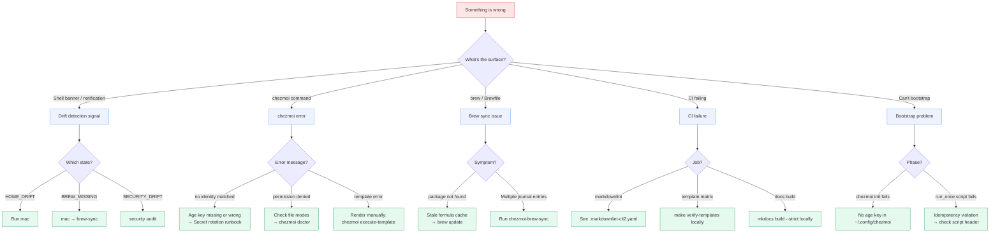

# Troubleshooting

Symptom-driven index. Find your error message, jump to the fix.


```mermaid
flowchart TD
    START["Something is wrong"]
    START --> Q1{What's the surface?}
    Q1 -->|Shell banner / notification| BANNER[Drift detection signal]
    Q1 -->|chezmoi command| CMD[chezmoi error]
    Q1 -->|brew / Brewfile| BREW[Brew sync issue]
    Q1 -->|CI failing| CI[CI failure]
    Q1 -->|Can't bootstrap| BOOT[Bootstrap problem]

    BANNER --> BS{Which state?}
    BS -->|HOME_DRIFT| FIX1["Run mac"]
    BS -->|BREW_MISSING| FIX2["mac → brew-sync"]
    BS -->|SECURITY_DRIFT| FIX3["security audit"]

    CMD --> CE{Error message?}
    CE -->|"no identity matched"| AGE["Age key missing or wrong<br/>→ Secret rotation runbook"]
    CE -->|"permission denied"| PERM["Check file modes<br/>→ chezmoi doctor"]
    CE -->|"template error"| TMPL["Render manually:<br/>chezmoi execute-template"]

    BREW --> BE{Symptom?}
    BE -->|"package not found"| BPF["Stale formula cache<br/>→ brew update"]
    BE -->|Multiple journal entries| BJE["Run chezmoi-brew-sync"]

    CI --> CIE{Job?}
    CIE -->|markdownlint| ML["See .markdownlint-cli2.yaml"]
    CIE -->|template matrix| TM["make verify-templates locally"]
    CIE -->|docs build| DB["mkdocs build --strict locally"]

    BOOT --> BE2{Phase?}
    BE2 -->|chezmoi init fails| BI["No age key in ~/.config/chezmoi"]
    BE2 -->|run_once script fails| BR["Idempotency violation<br/>→ check script header"]

    classDef start fill:#fee5e5,stroke:#d05656
    classDef surface fill:#eef2ff,stroke:#58a6ff
    classDef fix fill:#e5f9ee,stroke:#3aa56d
    class START start
    class BANNER,CMD,BREW,CI,BOOT surface
    class FIX1,FIX2,FIX3,AGE,PERM,TMPL,BPF,BJE,ML,TM,DB,BI,BR fix
```

## chezmoi errors

### `chezmoi apply` fails with "no identity matched any of the recipients"

**Cause**: The private age key at `~/.config/chezmoi/key.txt` is missing, world-readable, or doesn't match the recipient declared in `.chezmoi.toml.tmpl`.

**Fix**:

```bash
# 1. Confirm the key file exists and has 0600 perms.
ls -l ~/.config/chezmoi/key.txt
# Expected: -rw------- 1 ed staff ...

# 2. Confirm the public half matches the recipient.
age-keygen -y ~/.config/chezmoi/key.txt
# Compare against `recipient` line in .chezmoi.toml.tmpl.

# 3. If you've rotated the key recently but didn't re-encrypt all blobs,
#    follow Secret rotation → "Rotate the age key itself".
```

See [Secret rotation](runbooks/secret-rotation.md).

### `chezmoi apply` reports drift but `chezmoi diff` shows nothing

**Cause**: The drift cache (`~/.cache/chezmoi-drift/state`) is stale.

**Fix**:

```bash
rm -rf ~/.cache/chezmoi-drift
mac  # repopulates the cache
```

### `chezmoi verify` returns non-zero with empty stderr

**Cause**: A file in `$HOME` has different permissions than the source expects, but the *content* matches. `verify` checks both.

**Fix**: Run `chezmoi apply -v` (verbose) to see what specifically is being changed. Usually a permission fix.

## Brew sync issues

### `chezmoi-brew-sync` says "package not found"

**Cause**: A package in `~/.cache/brewup.log` is no longer in any tap chezmoi can reach.

**Fix**:

```bash
brew update
chezmoi-brew-sync  # try again
```

If still failing, the package was likely from a deprecated tap. Remove the offending line from `~/.cache/brewup.log` manually and re-run.

### Brew sync prompts for the same entry twice

**Cause**: The dedup logic considers package name + flags. If you `brew install foo` then `brew install --HEAD foo`, those are two distinct entries.

**Fix**: Accept both at the first prompt; the second pass will skip the duplicate.

See [Brew sync runbook](runbooks/brew-sync.md).

## Drift detection signals

### Shell banner shows drift but `mac` says nothing's pending

**Cause**: The banner reads `~/.cache/chezmoi-drift/state` (cheap, instant); `mac` re-runs the full check (slow, accurate). Cache is sometimes ahead of reality.

**Fix**: Just run `mac`. The cache rewrites.

### Banner shows `brewup-failed`

**Cause**: The daily `brewup` run exited non-zero and left `~/.cache/brewup.failed`. The marker is removed automatically by the next successful run.

**Fix**:

```bash
brewlog          # tail ~/.cache/brewup.log; the error is under the newest '=== brewup' header
brewup           # re-run once the cause is addressed
```

The most common cause is a **wedged cask staging directory**. An interrupted cask upgrade leaves the old app behind in the Caskroom, and every later upgrade aborts with:

```text
Error: <cask>: It seems there is already an App at
'/opt/homebrew/Caskroom/<cask>/<old-version>/<Name>.app'.
```

A full app inside a Caskroom version directory is always wreckage — Homebrew *moves* cask apps to `/Applications` and leaves only metadata behind. Clear it and reinstall:

```bash
rm -rf "/opt/homebrew/Caskroom/<cask>/<old-version>"
brew install --cask --force <cask>
```

Never use `brew uninstall --zap` here: `--zap` deletes application support data (browser profiles, bookmarks, licences), not just the app.

### `brew upgrade` touches a self-updating app (Chrome, Brave, NordVPN)

**Not a bug.** Casks marked `auto_updates true` are normally skipped without `--greedy`, but `HOMEBREW_UPGRADE_AUTO_UPDATES_CASKS` defaults to on, so Homebrew reads the real version out of the installed app's `Info.plist` and re-syncs when the app has fallen behind the tap. That is how an app updated in place by its own updater (Chrome's Keystone, which writes to `/Applications` as root) gets reconciled with Homebrew's records.

Keep these casks tracked in `Brewfile.tmpl` — `brew bundle check` only tests presence, not version, so a self-updated app still satisfies it. To opt out of the reconciliation, set `HOMEBREW_NO_UPGRADE_AUTO_UPDATES_CASKS=1`.

### Daily 09:30 notification didn't fire

**Cause**: LaunchAgent not loaded, or screen was locked at 09:30 and the OS deferred it past midnight.

**Fix**:

```bash
# Confirm the LaunchAgent is loaded.
launchctl list | grep chezmoi-drift

# Trigger manually.
launchctl kickstart -k gui/$UID/com.edjchapman.chezmoi-drift
```

See [Recover from drift](runbooks/recover-from-drift.md).

## CI failures

### `markdownlint` fails on a file you didn't edit

**Cause**: A new markdownlint rule version flagged something that was always there. The repo's `.markdownlint-cli2.yaml` disables a few rules (long lines, bare URLs); a new rule may need disabling.

**Fix**: Read the failing rule's docs ([rule list](https://github.com/DavidAnson/markdownlint/blob/main/doc/Rules.md)). If genuinely a false positive for this project, add to `.markdownlint-cli2.yaml`.

### `chezmoi templates (work / amd64)` fails

**Cause**: A template branch is referenced for one machine_type or arch but not implemented.

**Fix**:

```bash
# Reproduce locally.
make verify-templates

# Or just the failing cell.
chezmoi execute-template \
    --init --source="$(pwd)" \
    --override-data '{"machine_type":"work","gpg_signing_key":"test","chezmoi":{"arch":"amd64"}}' \
    < path/to/failing.tmpl
```

### `docs checks passed` fails with "mkdocs build --strict" error

**Cause**: New page added but not in `nav:`; or a `[link][undef]` reference; or a code block has an unknown language tag.

**Fix**:

```bash
# Reproduce locally (after pip install -r docs/requirements.txt).
mkdocs build --strict
```

See [Branch protection](runbooks/branch-protection.md).

## Bootstrap problems

### First `chezmoi init --apply edjchapman` fails immediately

**Cause**: The age private key isn't in `~/.config/chezmoi/key.txt`.

**Fix**: Drop the key file there first, then re-run `chezmoi init`. The [new-machine runbook](runbooks/new-machine.md) covers the full procedure.

### `run_once_*` script fails on second run

**Cause**: Idempotency violation. `run_once` scripts should be re-entrant; if they can't, they need state-detection at the top.

**Fix**: Run `chezmoi state delete-bucket --bucket=scriptState` to wipe the state DB and re-run. **This is destructive** — re-runs every `run_once_*` again.

## GPG problems

### GPG Services "Decrypt Selection" fails with `Decryption failed code = 152`

**Cause**: 152 is `GPG_ERR_DECRYPT_FAILED` — libgpg-error's catch-all, so it names nothing useful. The usual cause on this machine is **not** a missing or expired key: it's that Homebrew's `gnupg` 2.5 (a transitive dependency of `gpgme`/`gpgmepp`/`poppler`, ahead of MacGPG2 on `PATH`) started `gpg-agent` first and claimed `~/.gnupg/S.gpg-agent`. That agent serves the GUI service too, and Homebrew ships only `pinentry-curses` — so the GUI decrypt is handed a terminal prompt with no terminal.

**Fix**: `~/.gnupg/gpg-agent.conf` should pin the GUI pinentry. It is chezmoi-managed, so restore it from source rather than editing `$HOME`:

```bash
chezmoi diff ~/.gnupg/gpg-agent.conf
chezmoi apply ~/.gnupg/gpg-agent.conf
gpgconf --kill gpg-agent   # respawns on next use with the new config
```

**Confirm the fix**: stderr only ever says "decryption failed"; the `--status-fd` stream names the pinentry that actually launched.

```bash
gpg --batch --status-fd 2 --decrypt msg.asc 2>&1 >/dev/null \
  | grep -E 'PINENTRY_LAUNCHED|NO_SECKEY|DECRYPTION_(OKAY|FAILED)'
```

`PINENTRY_LAUNCHED … mac` is healthy; `… curses` is the broken state. A genuine `NO_SECKEY` means the key really is absent — a different problem.

See [Gotchas → Two GnuPG installations share one `~/.gnupg`](gotchas.md#macos-specific-traps).

## See also

- [Recover from drift](runbooks/recover-from-drift.md)
- [Secret rotation](runbooks/secret-rotation.md)
- [Brew sync](runbooks/brew-sync.md)
- [Gotchas](gotchas.md)
- [FAQ](faq.md)
